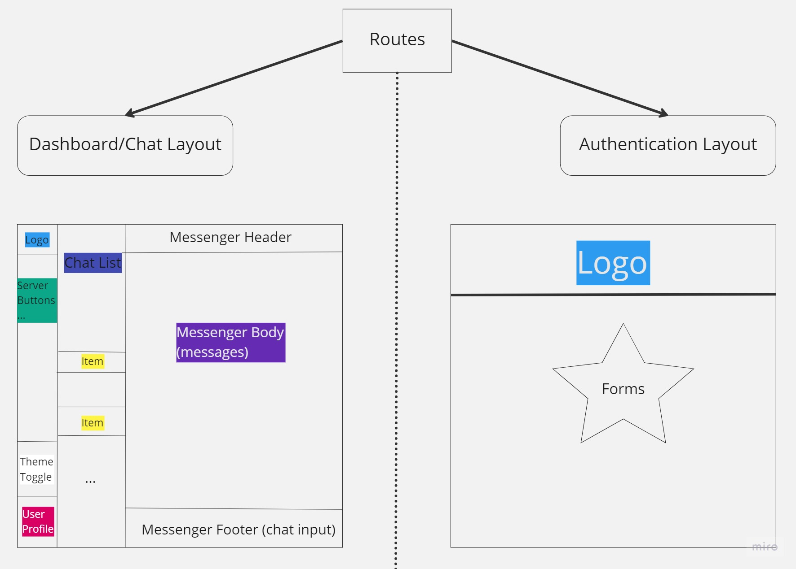
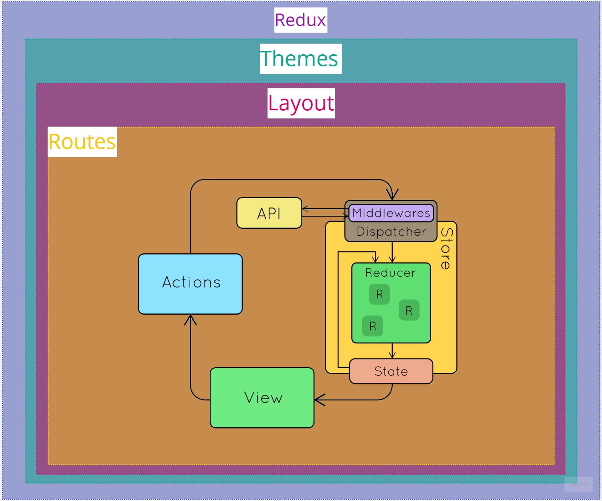

## FRONTEND SIDE - WEBAPP

#### Prerequisites:
    If you would like to use test files, please install: "jest", "typescript" libraries.
#### Configurations: 
    Contact me if you want to have look at .env file (can not add to Github).
#### How to run the project?
    In test mode: yarn test -  Launches the test runner in the interactive watch mode.
    In development mode: yarn dev -  Open http://localhost:5000 to view it in your browser.
    In production mode: yarn run build 
#### Description: 
    This part is mainly for visualizing data from server.
#### Technologies: 
    "react": is a JavaScript library for creating user interfaces.
    "react-router-dom": to manage router in a whole of app.
    "react-helmet-async": to encapsulate data on a per-request basis, this package does just that.
    "react-i18next": is a powerful internationalization framework for React which based on i18next.
    "@mui/material": is a library of React UI components that implements Google's Material Design.
    "stylis-plugin-rtl": Right-to-left languages such as Arabic, Persian, or Hebrew are supported.
    "phosphor-react": is a flexible icon family for interfaces, diagrams, presentations
    "simplebar-react": to keep the native overflow: auto scroll and only replace the scrollbar visual appearance.
    "framer-motion": to create animation for buttons.
    "prop-types": type checking for React props.
    "emoji-mart": emoji families.
    "@iconify/react": icons for the whole app.
    "yup": validate app's forms.
    "socket.io-client": generate sockets from cliean side.
    "redux": state management.
    "redux-saga": redux middleware which listens our app's actions (e.g: call api after a action is dispatched)
    "@reduxjs/toolkit": setting up redux root store automatically (createSlice)
    "history": using to custom app's navigate hook (using in redux-saga)
    "react-hook-form": form management.

    --- dev-dependencies ---
    "jest": testing our app.
    "@faker-js/faker": fake avatars and texts.

###Overall

1. Folder Structure (./src/...):

- api: where we create axios client and apis.
- assets: contains logo and a "noChat" component.
- components: contains several dumb components.
- config: saves common setting of this webapp including DEFAULT_PATH, LANGS...
- data: development data (fake chat_list, fake messages...) and defined icon objects
- hooks: custom and define personal-using hooks
- models: defines type of data.
- layouts: defines auth/dashboard layout of this application.
- model: define TypeScript types (I don't have too much time, so "any" perhaps is a good choice :( )
- pages: contains pages of this webapp including: 404 not-found page, auth, main messenger and setting page.
- providers: theme-setting, setting-app providers.
- routes: seperate auth/dashboard route.
- sections: form structures, message types (incoming, outgoing,...)
- store: where we initialize reducer store and root saga
- theme: provides theme, color for a whole of app (idea from a MUI template).
- utils: store a couple of small functions like: authHandler, getLocation...

##### socket.ts: initialize socket-client

2. Concepts of this chatapp:

#### a) API: http requests

- A page in src/pages: dispatch a action by useAppSelector (e.g: getUserInfo) 

- Store (src/pages: something.slice.ts): is dispatched

- Middlewares: redux-saga (src/pages/ something.saga.ts)
    + a saga calls api from src/api folder
    + changes state in the store

- View (src/pages Something.tsx): receives "state" by using useAppSelector

#### b) Socket:

- In src/layouts:
+ connect socket
+ on/wait data from server emits (e.g: new messages)

- A page in src/pages 
+ emit info (e.g: user ID to get back a list of messages related to that user or 'end' to singout)

#### c) Features:
- Sign in/ resgister/ reset password/ verify OTP

- Get location of user and emit to server.
- Notify the rest of server when a user logged in or it is the first time join in.
- Chat 1v1 (of course)

#### d) Unfinnished features:

- Calling
- Send: files, images...
- Settings profile

3. References (idea, theme...):

[MUI template](https://mui.com/material-ui/getting-started/templates/dashboard)

[Learning how work with socket](https://medium.com/@otterlord/learn-socket-io-real-time-chat-app-f99162c5a0a9)

[Redux toolkit set up](https://github.com/paulnguyen-mn/redux-toolkit)

[Folder Structure set up](https://github.com/codingmonk-yt/chat-app-latest)

[My old project](https://github.com/HoangCaesar/Fullstack_Projects/tree/master/Helsinki_City_Bike)

